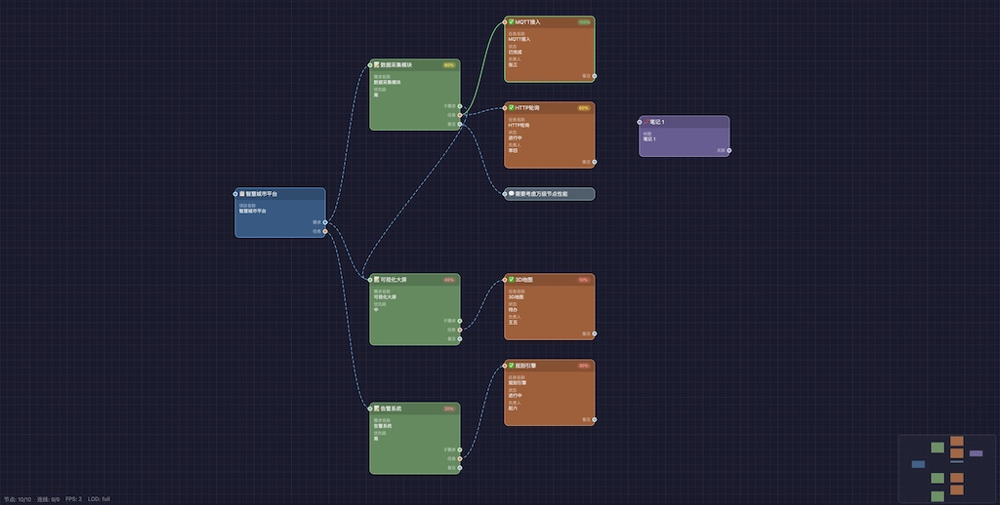

# @rleecn/liteflow



高性能节点式工作流 Vue 组件。

## 特性

- **Canvas 2D 渲染** — 避免 DOM 节点爆炸，万级节点流畅运行
- **视口裁剪** — 只渲染视口内可见的节点和连线
- **双 Canvas 分层** — 背景层（网格）和前景层（节点/连线）独立渲染
- **LOD 分级渲染** — 缩小时自动简化节点细节，保障性能
- **脏标记渲染** — 仅在数据或视口变化时重绘
- **Retina 适配** — 自动处理 devicePixelRatio，Mac/Windows 体验一致
- **节点分组** — 支持创建分组，拖拽分组时内部节点一起移动
- **缩略图导航** — 右下角缩略图支持点击和拖拽快速定位
- **右键菜单** — 两级分类展示，支持创建节点和分组
- **自定义节点类型** — 运行时注册自定义节点，自动出现在右键菜单
- **可选内置组件** — 可禁用内置节点类型，仅使用自定义类型

## 安装

```bash
npm install @rleecn/liteflow
```

## 快速开始

```vue
<template>
  <LiteFlowCanvas
    ref="flowCanvas"
    @node-select="onNodeSelect"
  />
</template>

<script setup lang="ts">
import { ref } from 'vue'
import { LiteFlowCanvas } from '@rleecn/liteflow'
import type { LFNode } from '@rleecn/liteflow'

const flowCanvas = ref()
const selectedNode = ref<LFNode | null>(null)

function onNodeSelect(node: LFNode | null) {
  selectedNode.value = node
}
</script>
```

## 仅使用自定义节点类型

默认会加载内置节点类型（项目管理、思维导图、UML、流程图）。如果只需要自定义类型，设置 `builtin-types` 为 `false`：

```vue
<LiteFlowCanvas :builtin-types="false" @node-select="onNodeSelect" />
```

然后在组件挂载前注册自定义类型：

```ts
import { registerCategory, registerNodeType } from '@rleecn/liteflow'

registerCategory('my-app', '我的应用')
registerNodeType({
  type: 'my-node',
  title: '自定义节点',
  icon: '🔧',
  category: 'my-app',
  color: '#2d5986',
  borderColor: '#4a9ae0',
  headerColor: 'rgba(0,0,0,0.15)',
  slots: [
    { id: 'in', label: '输入', dir: 'in', color: '#4a9ae0' },
    { id: 'out', label: '输出', dir: 'out', color: '#4a9ae0' },
  ],
  fields: [
    { key: 'name', label: '名称', type: 'text' },
  ],
  defaultData: { name: '' },
})
```

## 注册自定义节点类型

```ts
import { registerCategory, registerNodeType } from '@rleecn/liteflow'

// 1. 注册分类（出现在右键菜单一级）
registerCategory('database', '数据库')

// 2. 注册节点类型（自动出现在右键菜单对应分类下）
registerNodeType({
  type: 'mysql',           // 唯一标识
  title: 'MySQL',          // 显示名称
  icon: '🗄',              // 图标
  category: 'database',    // 所属分类 ID
  color: '#00758f',        // 节点背景色
  borderColor: '#00a8cc',  // 边框色
  headerColor: 'rgba(0,0,0,0.15)', // 标题栏背景
  slots: [                 // 连接端口
    { id: 'out', label: '数据', dir: 'out', color: '#00a8cc' },
  ],
  fields: [                // 属性字段（决定节点内容展示和右侧面板编辑项）
    { key: 'host', label: '主机', type: 'text' },
    { key: 'port', label: '端口', type: 'number', min: 1, max: 65535, step: 1 },
    { key: 'query', label: 'SQL', type: 'textarea' },
  ],
  defaultData: { host: 'localhost', port: 3306, query: '' },
})
```

### 字段类型

| type | 说明 | 额外属性 |
|------|------|----------|
| `text` | 单行文本 | — |
| `textarea` | 多行文本 | — |
| `number` | 数字 | `min`, `max`, `step` |
| `select` | 下拉选择 | `options: string[]` |
| `range` | 滑块 | `min`, `max`, `step` |

### 端口定义

```ts
interface LFSlot {
  id: string       // 端口唯一标识
  label: string    // 显示标签
  dir: 'in' | 'out'  // 输入或输出
  color: string    // 端口圆点颜色
}
```

### 自动连线推断

从输出端口拖线到空白区域时，会根据端口 ID 自动推断目标节点类型。内置推断规则：

| 源端口 ID | 推断目标类型 |
|-----------|-------------|
| `requirement` | `requirement` |
| `sub-requirement` | `requirement` |
| `task` | `task` |
| `remark` | `remark` |
| `note-out` | `note` |
| `branch` | `mind-branch` |
| `leaf` | `mind-leaf` |
| `inherit` / `implement` / `compose` | `uml-class` |
| `out` / `yes` / `no` | `flow-process` |

可通过 `getTargetNodeType(sourceType, slotId)` 查询推断结果。

## 组件 API

### Props

| Prop | 类型 | 默认值 | 说明 |
|------|------|--------|------|
| `builtin-types` | `boolean` | `true` | 是否注册内置节点类型。设为 `false` 则只使用自定义注册的节点类型 |

### Events

| 事件 | 参数 | 说明 |
|------|------|------|
| `node-select` | `node: LFNode \| null` | 节点选中/取消选中时触发 |

### Methods (ref)

| 方法 | 签名 | 说明 |
|------|------|------|
| `addNode` | `(type: string, data?, position?) => LFNode` | 添加节点 |
| `addGroup` | `(title, x, y, width?, height?, color?) => LFGroup` | 添加分组 |
| `addEdge` | `(sourceId, sourceSlot, targetId) => void` | 添加连线 |
| `serialize` | `() => { nodes, edges, groups }` | 序列化图数据 |
| `deserialize` | `(data) => void` | 反序列化图数据 |
| `clearAll` | `() => void` | 清空所有节点、连线和分组 |
| `getNodes` | `() => LFNode[]` | 获取所有节点 |
| `markDirty` | `() => void` | 标记需要重绘 |
| `autoLayout` | `() => void` | 自动布局（按依赖层级排列） |
| `loadMockData` | `() => void` | 加载示例数据 |
| `loadMockData5000` | `() => void` | 加载 5000 节点压力测试数据 |

### 暴露属性

| 属性 | 类型 | 说明 |
|------|------|------|
| `engine` | `LFEngine` | 底层图引擎实例，可直接操作数据 |

## 引擎 API (LFEngine)

通过 `flowCanvas.value.engine` 访问，也可独立使用：

```ts
import { LFEngine } from '@rleecn/liteflow'

const engine = new LFEngine()
```

### 节点操作

| 方法 | 签名 | 说明 |
|------|------|------|
| `addNode` | `(type, data?, position?) => LFNode` | 添加节点 |
| `removeNode` | `(id) => void` | 删除节点及其关联连线 |
| `getNode` | `(id) => LFNode \| undefined` | 按 ID 查找节点 |
| `moveNode` | `(id, x, y) => void` | 移动节点 |
| `selectNode` | `(id \| null) => void` | 选中节点（null 取消选中） |
| `duplicateNode` | `(id) => LFNode \| null` | 复制节点（偏移 40px） |

### 连线操作

| 方法 | 签名 | 说明 |
|------|------|------|
| `addEdge` | `(sourceId, sourceSlot, targetId, targetSlot?) => LFEdge` | 添加连线 |
| `removeEdge` | `(id) => void` | 删除连线 |
| `getEdgesOfNode` | `(nodeId) => LFEdge[]` | 获取节点关联的所有连线 |

### 分组操作

| 方法 | 签名 | 说明 |
|------|------|------|
| `addGroup` | `(title, x, y, width?, height?, color?) => LFGroup` | 添加分组 |
| `removeGroup` | `(id) => void` | 删除分组 |
| `getGroup` | `(id) => LFGroup \| undefined` | 按 ID 查找分组 |
| `moveGroup` | `(id, dx, dy) => void` | 移动分组及内部节点 |
| `updateGroupNodes` | `(group) => void` | 重新计算分组包含的节点 |
| `getGroupOfNode` | `(nodeId) => LFGroup \| undefined` | 查找节点所在分组 |

### 序列化

| 方法 | 签名 | 说明 |
|------|------|------|
| `serialize` | `() => LFGraph` | 序列化为 JSON 可序列化对象 |
| `deserialize` | `(graph) => void` | 从数据恢复 |
| `clear` | `() => void` | 清空所有数据 |

## 注册中心 API

| 方法 | 说明 |
|------|------|
| `registerBuiltinTypes()` | 注册内置节点类型（含防重复保护） |
| `registerCategory(id, label)` | 注册分类 |
| `removeCategory(id)` | 移除分类 |
| `getCategories()` | 获取所有分类 |
| `registerNodeType(nodeType)` | 注册节点类型 |
| `removeNodeType(type)` | 移除节点类型 |
| `getNodeType(type)` | 获取节点类型定义 |
| `getAllNodeTypes()` | 获取所有节点类型 |
| `getNodeTypesByCategory(categoryId)` | 获取分类下所有节点类型 |
| `getTargetNodeType(sourceType, slotId)` | 根据源端口推断目标节点类型 |

## 内置节点类型

默认加载，可通过 `:builtin-types="false"` 禁用。

| 分类 | 节点 | type | 端口 |
|------|------|------|------|
| 项目管理 | 项目 | `project` | in, requirement, task |
| 项目管理 | 需求 | `requirement` | in, sub-requirement, task, remark |
| 项目管理 | 任务 | `task` | in, remark |
| 项目管理 | 笔记 | `note` | in, note-out |
| 项目管理 | 备注 | `remark` | in |
| 思维导图 | 中心主题 | `mind-center` | branch |
| 思维导图 | 分支主题 | `mind-branch` | in, branch, leaf |
| 思维导图 | 叶子节点 | `mind-leaf` | in |
| UML | 类 | `uml-class` | in, inherit, compose |
| UML | 接口 | `uml-interface` | in, implement |
| UML | 枚举 | `uml-enum` | in, compose |
| 流程图 | 开始 | `flow-start` | out |
| 流程图 | 结束 | `flow-end` | in |
| 流程图 | 处理 | `flow-process` | in, out |
| 流程图 | 判断 | `flow-decision` | in, yes, no |
| 流程图 | 输入/输出 | `flow-io` | in, out |

## 交互操作

| 操作 | 说明 |
|------|------|
| 左键拖拽空白 | 平移画布 |
| 滚轮 | 缩放画布（以鼠标位置为中心） |
| 左键拖拽节点 | 移动节点 |
| 左键拖拽分组 | 移动分组及内部节点 |
| 右下角圆形手柄 | 调整节点宽高 |
| 右下角矩形手柄 | 调整分组宽高 |
| 端口圆点拖拽 | 创建连线，松开到空白区域自动创建目标节点 |
| 右键 | 打开上下文菜单 |
| 缩略图点击/拖拽 | 快速导航到指定区域 |

## 类型定义

```ts
interface LFNode {
  id: string
  type: string
  x: number
  y: number
  width: number
  height: number
  minHeight: number
  data: Record<string, any>
  selected: boolean
  collapsed: boolean
}

interface LFEdge {
  id: string
  sourceId: string
  sourceSlot: string | null
  targetId: string
  targetSlot: string | null
}

interface LFGroup {
  id: string
  title: string
  x: number
  y: number
  width: number
  height: number
  color: string
  nodeIds: string[]
}

interface LFGraph {
  nodes: LFNode[]
  edges: LFEdge[]
  groups: LFGroup[]
}

interface LFSlot {
  id: string
  label: string
  dir: 'in' | 'out'
  color: string
}

interface LFField {
  key: string
  label: string
  type: 'text' | 'textarea' | 'select' | 'range' | 'number'
  options?: string[]
  min?: number
  max?: number
  step?: number
}

interface LFNodeType {
  type: string
  title: string
  icon: string
  category: string
  color: string
  borderColor: string
  headerColor: string
  slots: LFSlot[]
  fields: LFField[]
  defaultData: Record<string, any>
  drawBody?: (ctx: CanvasRenderingContext2D, node: LFNode, lod: LODLevel, nodeType: LFNodeType) => void
}

interface LFViewport {
  x: number
  y: number
  zoom: number
}

type LODLevel = 'full' | 'medium' | 'minimal'

interface LFStats {
  totalNodes: number
  visibleNodes: number
  totalEdges: number
  visibleEdges: number
  fps: number
  lod: LODLevel
}

interface LFPoint {
  x: number
  y: number
}
```

## 序列化 / 反序列化

```ts
// 保存
const data = flowCanvas.value?.serialize()
localStorage.setItem('workflow', JSON.stringify(data))

// 加载
const data = JSON.parse(localStorage.getItem('workflow') || '{}')
flowCanvas.value?.deserialize(data)
```

## 架构

```
LiteFlowCanvas.vue    Vue 组件层，处理生命周期和 DOM
  ├── LFEngine        数据引擎，管理节点/边/分组的 CRUD
  ├── LFRenderer      渲染器，Canvas 2D 绘制 + 交互事件
  └── Registry        注册中心，管理节点类型和分类
```

- **数据与渲染分离** — `LFEngine` 只管数据，`LFRenderer` 只管绘制和交互
- **双 Canvas 分层** — 背景网格和前景内容分别绘制，背景仅在视口变化时重绘
- **LOD 渲染** — `full`（完整细节）→ `medium`（仅标题+进度）→ `minimal`（色块+迷你进度条）
- **惰性类型缓存** — 节点类型的布局信息按需计算并缓存，支持运行时注册新类型
